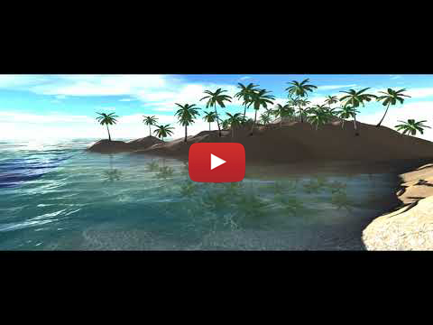
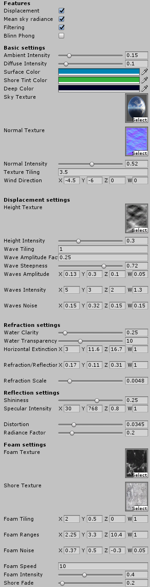

# Procedural Water 
A procedural water shader, multi platforrm support(Unity, GLSL, HLSL), for a variety of water types.

## Features
The water shader is designed for various water types: lakes, ocean and rivers.

Current implemented features are:
- multiple maps(height, normal, shore, sky)
- configurable refraction and reflection
- colour extiction based water depth
- mean sky radiance
- displacement
- enabling/disabling features
- bicubic filtering
- configurable shore foam
- HLSL/GLSL/Unity support(for GLSL use the conversion script to SPIR-V)
	
## Usage

The shader requires refraction and reflection maps of the scene, the refraction map also requires the depth.
See the textures folder for examples of sky, shore, foam, height and normal maps. 

Certain features can be switched off via the following defines:
- USE_DISPLACEMENT, adds displacement of gerstner and sinve waves, with an additional height map
- USE_MEAN_SKY_RADIANCE, adds mean sky radiance reflectance, requires a sky map
- USE_FILTERING, enable/disable bicubic filtering
- BLINN_PHONG, use simplified specular

## Preview

Composition of the water(final, shore, refraction+depth colour, reflection + distortion, diffuse + ambient, normals):

## Future improvements

Planned improvements are:
- caustics
- underwater mode with light rays
- cascading depth maps
- improved water displacement/simulation(FFT)

## Contributing

Based on:
- [Rendering Water as a Post-process Effect by Wojciech Toman](https://www.gamedev.net/articles/programming/graphics/rendering-water-as-a-post-process-effect-r2642/).
- [GPU Gems Chapter 1. Effective Water Simulation from Physical Models, by Mark Finch and Cyan Worlds](http://developer.download.nvidia.com/books/HTML/gpugems/gpugems_ch01.html)
- [Real-time Realistic Ocean Lighting using Seamless Transitions from Geometry to BRDF by Eric Bruneton, Fabrice Neyret, Nicolas Holzschuch](https://hal.inria.fr/inria-00443630/file/article-1.pdf)
- [HLSL 2D simplex noise function by Ian McEwan, Ashima Arts](https://github.com/ashima/webgl-noise)

Bug reports and pull requests are welcome on GitHub at https://github.com/tuxalin/water-shader.

## License

The code is available as open source under the terms of the [MIT License](http://opensource.org/licenses/MIT).
